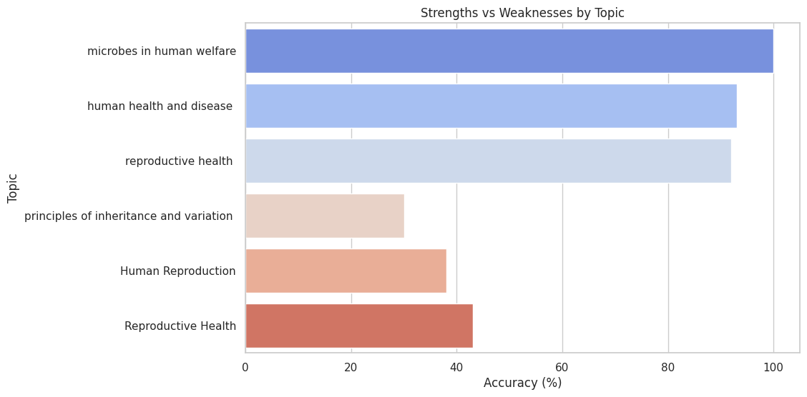
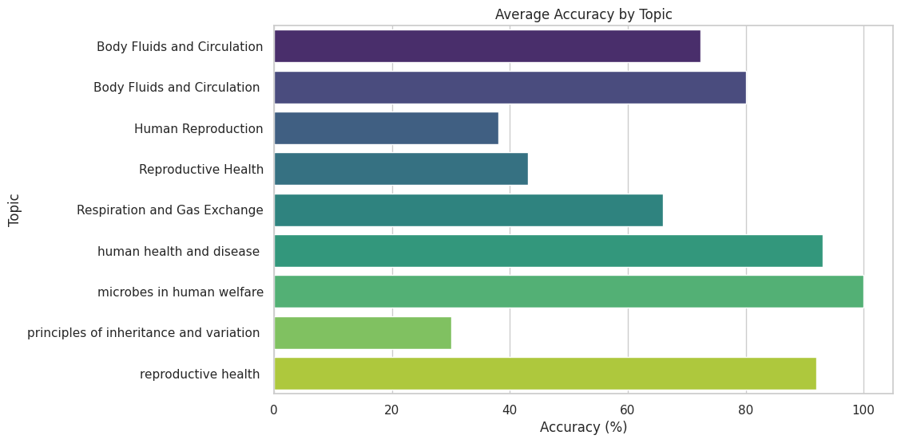

# Quiz-insight-analyzer

## Overview
This project analyzes student performance data to generate insights and actionable recommendations. It uses patterns in the data to highlight areas for improvement, identify strengths, and propose targeted learning strategies. The tool also creates a detailed student persona based on performance trends, making it easier to personalize educational guidance.

---

## Features
- **Data Analysis**: Explore patterns in student performance by topics, difficulty levels, and response accuracy.
- **Insights Generation**: Highlight weak areas, improvement trends, and performance gaps.
- **Recommendations**: Provide actionable steps for improvement, such as suggested topics and question types.
- **Student Persona Creation**: Define a student's strengths and weaknesses with creative labels and insights.

---

## Setup Instructions

### Prerequisites
Ensure you have the following installed:
- Python (>=3.8)
- Jupyter Notebook

### Steps
1. Clone the repository:
   ```bash
   git clone https://github.com/rahulgaharwar/quiz-insight-analyzer.git
   ```
2. Navigate to the project directory:
   ```bash
   cd quiz-insight-analyzer
   ```
3. Install the required libraries:
   ```bash
   pip install -r requirements.txt
   ```
4. Open the Jupyter Notebook:
   ```bash
   jupyter notebook main.ipynb
   ```
5. Follow the instructions in the notebook to run the analysis.

---

## Data Format
The input data should be a JSON file with the following structure:
```json
[
  {
    "id": 336497,
    "quiz_id": 51,
    "user_id": "example_user_id",
    "submitted_at": "2025-01-17T15:30:18.027+05:30",
    "score": 108,
    "accuracy": "90 %",
    "final_score": "105.0",
    "correct_answers": 27,
    "incorrect_answers": 3,
    "topic": "Body Fluids and Circulation",
    "difficulty_level": "Medium",
    ...
  }
]
```
A sample file is included in the `data/` folder.

---

## Insights Summary
The tool generates insights such as:
- Topics where students excel or struggle.
- Trends in performance over time.
- Accuracy and mistake patterns.

### Example Insight
**Weak Area**: "Body Fluids and Circulation"  
**Recommendation**: Focus on "Medium" and "Hard" difficulty questions.

---

## Screenshots
### Visualization Examples:
- **Performance by Topic**:
  
- **Accuracy Trends**:
  

---

## Demo Video
A video link demonstrating the tool is included in the `/demo_video` file. Alternatively, you can view it [here](https://drive.google.com/file/d/1ZDDozkTxqhy_5jMrnRWCB1mECfx_bSsk/view?usp=sharing).

### Contents of the Video
1. Introduction to the project.
2. Loading and analyzing sample data.
3. Visualizations and insights generation.

---

## Contributions
Contributions are welcome! Please submit a pull request or create an issue if you have suggestions or encounter any problems.

---

## License
This project is licensed under the [MIT License](LICENSE).

